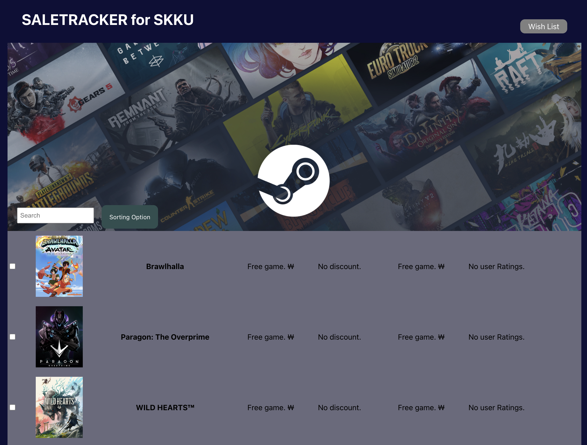
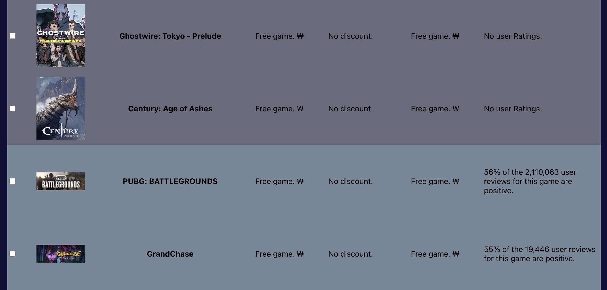
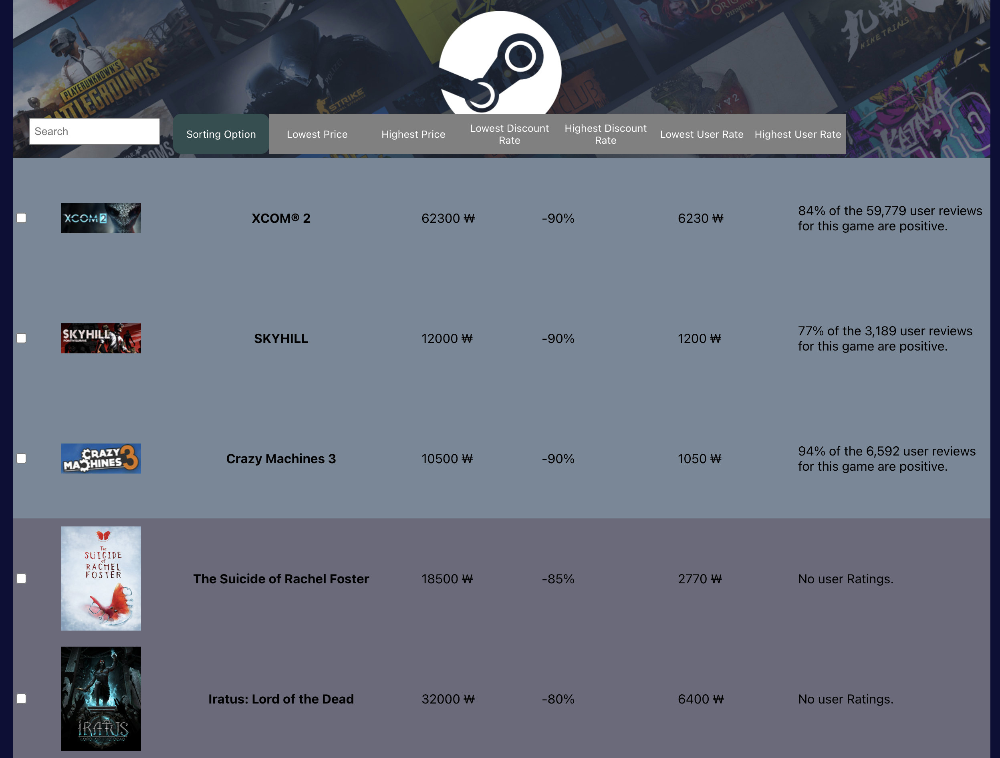
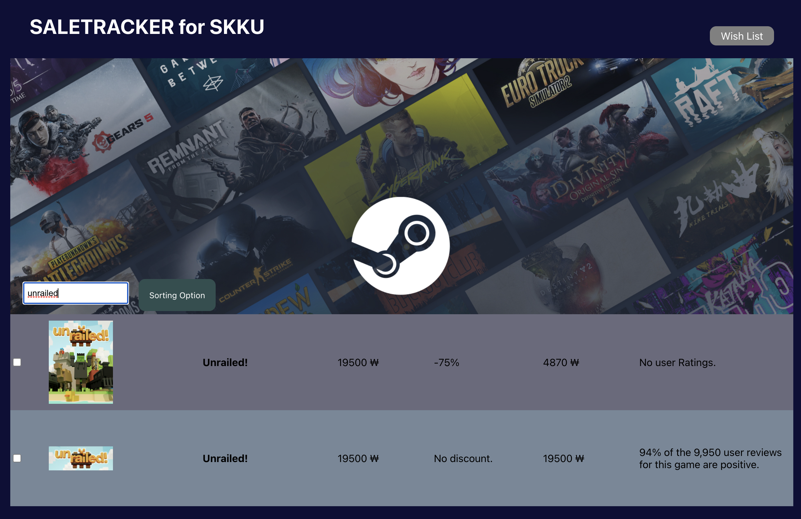
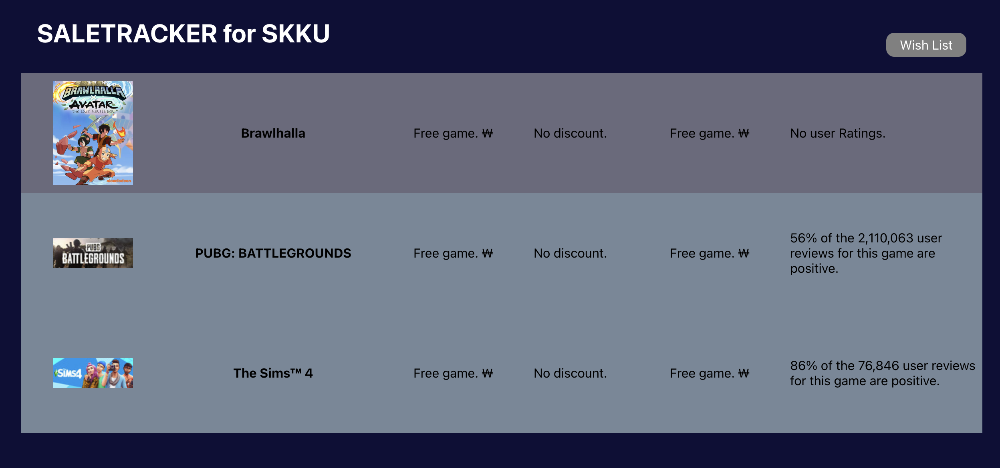

<a name="readme-top"></a>

<div>
<h1 align="center">✨ SaleTracker for SKKU</h3>
<h3 align="center">All the game deals in one place</h3>
  <p align="center">
    <a href="#presentation">View presentation</a>
    ·
    <a href=https://github.com/seeewd/oss_steamtracker/issues>Report Bug</a>
        ·
    <a href="https://github.com/seeewd/oss_steamtracker/issues">Request Feature</a>
  </p>
</div>

<!-- ABOUT THE PROJECT -->

## About The Project



SaleTracker is an open-source web project designed to provide multi-platform game deals for your needs. Not only do we provide a list of game info, we also provide sorting as well as a place to store your favourites.

- <strong>Provides games from both STEAM and Epic Games</strong>
- <strong>Provides joint sorting and searching games for both platforms according to your needs</strong>
- <strong>Provides a 'Wish List' to store your favourites</strong>

<!-- GETTING STARTED -->

## Getting Started

You can either: Access SaleTracker online or build from source.

### 🔗 Link

To visit our website:

[http://oss-steamtracker.s3-website.ap-northeast-2.amazonaws.com/](http://oss-steamtracker.s3-website.ap-northeast-2.amazonaws.com/)

**or**

### ⏳ Installation

_Below is an instruction of how you install our project locally._

1. Clone the repo
   ```sh
   git clone https://github.com/seeewd/oss_steamtracker.git
   cd oss_steamtracker
   ```
2. Specify NVM version
   ```sh
   nvm use 16.10.0
   ```
3. Install NPM packages
   ```sh
   npm install
   ```
4. Start website
   ```sh
   npm start
   ```

---

### 📥 Update scrape data

1. Navigate to web-scraper
   ```sh
   cd src/web-scraping
   ```
2. Run scraper.js
   ```sh
   node scraper.js [mode] [numGames]
   ```

_Below is an example of how you update the lastest games from STEAM._

- Get latest 200 top selling games

  ```sh
  node scraper.js top 200
  ```

- Get latest 100 new popular games

  ```sh
  node scraper.js popularNew 100
  ```

Default scraper execution results to scraping top 100 games. numGames should be a multiple of 50 as the website gives 50 games per request.

<!-- Usage -->

## Usage

### Feature: Games from both STEAM and Epic Games


You can browse all the games provided by both platforms, which are color coded accordingly. There is no need for you to check one site after another!

### Sorting and searching games for both platforms



We provide extensive sorting methods as well as searching for your convenience. From lowest price, highest discount rate to highest user rate, we provide multi-platform sorting and searching. You will know where to buy the games and will not miss out on any deals!

### Provides a 'Wish List' to store your favourites


After browsing through all the deals provided, you will want a place to store your wish lists. We provide a storage for your favourite games for you to come back and check the deals!

<!-- Presentation -->

## Presentation<a name="presentation"></a>

[](https://youtu.be/hoCoOwx7QhY)

<!-- LICENSE -->

## License

Distributed under the MIT License. See `LICENSE.txt` for more information.

<!-- Credits -->

## Credits

- [Wi Seong Cho](https://github.com/seeewd)
- [Sangyun Shin](https://github.com/sangyun0914)
- [JinHyeok Lee](https://github.com/tool7831)
<p align="right">(<a href="#readme-top">back to top</a>)</p>

---

우수 프로젝트 시상 프로그램에 지원합니다
